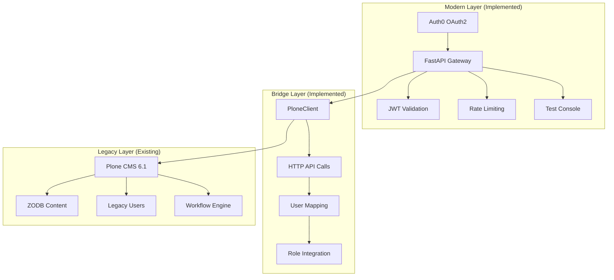
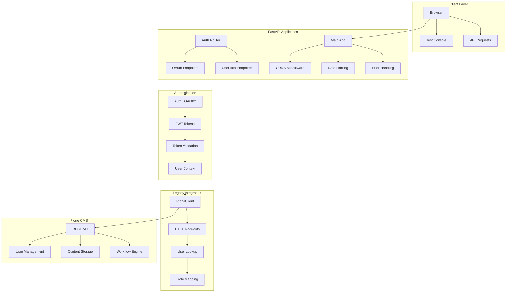
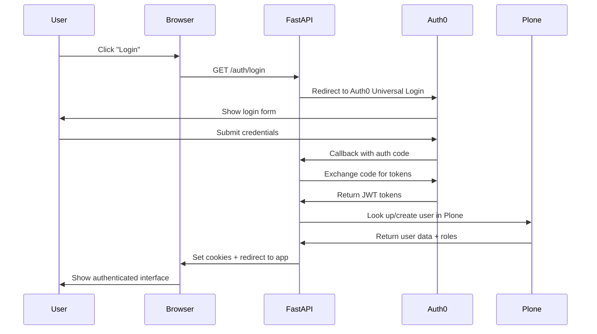
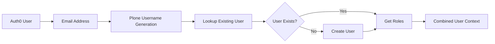

# EduHub System Architecture

> **Current Status**
> EduHub is a *modern FastAPI gateway* that provides OAuth2 authentication and API access to an existing **Plone CMS** core.
> All authentication flows through Auth0, content comes from Plone via HTTP API calls, and the system is designed for 
> incremental modernization without disrupting existing workflows.

This document outlines the actual implemented architecture, technical design, and integration patterns for the EduHub education portal.

## 📋 Table of Contents
1. [System Overview](#system-overview)
2. [Implemented Architecture](#implemented-architecture)
3. [Technology Stack (Actual)](#technology-stack-actual)
4. [Authentication Flow](#authentication-flow)
5. [Plone Integration](#plone-integration)
6. [API Design](#api-design)
7. [Security Implementation](#security-implementation)
8. [Deployment Architecture](#deployment-architecture)
9. [Testing Strategy](#testing-strategy)
10. [Performance Characteristics](#performance-characteristics)

## 🎯 System Overview

EduHub modernizes access to an existing Plone CMS through a FastAPI gateway that provides OAuth2 authentication and JSON API endpoints.

### What We Actually Built
- **Auth0 OAuth2 Gateway**: Complete authorization code flow with JWT validation
- **FastAPI API Layer**: Async Python endpoints for authentication and Plone integration
- **PloneClient HTTP Bridge**: Async HTTP client for communicating with legacy CMS
- **Interactive Test Console**: HTML-based testing interface for OAuth flows
- **Security Features**: Rate limiting, CORS, audit logging, token validation

### Strategic Approach


## 🏗️ Implemented Architecture

### Current System Design
The implemented system follows a **gateway pattern** where FastAPI acts as a modern frontend to the legacy Plone CMS.



## 🔧 Technology Stack (Actual)

### Core Application
```yaml
Language: Python 3.13
Web Framework: FastAPI 0.115+
ASGI Server: Uvicorn
HTTP Client: httpx 0.28+ (async)
Authentication: Auth0 OAuth2
Token Format: JWT (JSON Web Tokens)
Data Validation: Pydantic 2.10+
```

### Authentication Stack
```yaml
OAuth Provider: Auth0 (dev-1fx6yhxxi543ipno.us.auth0.com)
Auth Flow: Authorization Code Flow
Token Storage: HTTP-only cookies + localStorage
Token Validation: python-jose with JWKS
Session Management: Cookie-based with logout clearing
```

### Integration Layer
```yaml
Legacy System: Plone CMS 6.1
Communication: HTTP REST API calls
Client: Custom PloneClient (async httpx)
Data Format: JSON transformation
User Mapping: Auth0 email → Plone username
Role Integration: Auth0 metadata + Plone groups
```

### Security Features
```yaml
Rate Limiting: In-memory token bucket (5 req/min)
CORS: Configured for Auth0 callbacks
Audit Logging: JSON structured logs
Error Handling: Structured HTTP error responses
Token Security: JWT signature validation + expiry
```

### Development & Testing
```yaml
Testing: pytest + httpx for integration tests
Documentation: FastAPI auto-generated OpenAPI
Development: Hot reload with uvicorn --reload
Quality: black, isort, mypy type checking
CI/CD: GitHub Actions with Docker builds
```

## 🔐 Authentication Flow

### OAuth2 Authorization Code Flow (Implemented)


### JWT Token Structure
```json
{
  "sub": "auth0|68842107aaae2aea048f36a9",
  "email": "dev@example.com",
  "email_verified": false,
  "name": "dev@example.com",
  "picture": "https://s.gravatar.com/avatar/...",
  "nickname": "dev",
  "aud": "s05QngyZXEI3XNdirmJu0CscW1hNgaRD",
  "iss": "https://dev-1fx6yhxxi543ipno.us.auth0.com/",
  "exp": 1753581707,
  "iat": 1753545707
}
```

## 🔗 Plone Integration

### PloneClient Implementation
The `PloneClient` class provides async HTTP communication with the legacy Plone CMS:

```python
# Implemented features:
- async def authenticate()  # Get Plone auth token
- async def get_user_by_email()  # Look up existing users
- async def create_user()  # Create new users when needed
- async def get_user_roles()  # Fetch role/group information
- Connection pooling with httpx.AsyncClient
- Graceful error handling and retries
```

### User Mapping Strategy


### Data Transformation
```python
# Auth0 → Plone mapping
auth0_email = "dev@example.com"
plone_username = "dev_example_com"  # Generated from email
plone_user_id = "user_123"  # From Plone lookup

# Combined user context
user_context = {
    "auth0_data": {...},      # JWT claims
    "plone_user_id": "...",   # Plone user ID
    "plone_groups": [...],    # Plone roles/groups
    "combined_roles": [...]   # Merged role set
}
```

## 🚀 API Design

### Implemented Endpoints
```yaml
# Authentication
GET  /auth/login          # Redirect to Auth0
GET  /auth/callback       # Handle Auth0 response
GET  /auth/user           # Get current user info
POST /auth/logout         # Clear session + Auth0 logout
GET  /auth/token-status   # Check token validity
POST /auth/clear-session  # Local session cleanup

# Application
GET  /                    # API info
GET  /docs               # Interactive documentation
GET  /openapi.json       # OpenAPI schema
GET  /favicon.ico        # App favicon

# Testing
GET  /test/auth-console  # Interactive OAuth test interface

# Plone Integration (via PloneClient)
# - User lookup and creation
# - Role/group synchronization  
# - Graceful fallback when Plone unavailable
```

### Response Formats
```json
// Successful authentication
{
  "sub": "auth0|123...",
  "email": "user@example.com",
  "name": "User Name",
  "plone_user_id": "user_123",
  "plone_groups": ["Members", "Reviewers"],
  "roles": ["authenticated", "reviewer"]
}

// Error response
{
  "detail": "Not authenticated",
  "error_code": "INVALID_TOKEN",
  "timestamp": "2025-01-26T10:30:00Z"
}
```

## 🛡️ Security Implementation

### JWT Validation
```python
# Implemented security measures:
- JWKS key rotation support
- Token expiry validation  
- Signature verification
- Issuer validation
- Graceful error handling
```

### Rate Limiting
```python
# Per-endpoint rate limits:
- /auth/login: 5 requests per minute
- /auth/user: 10 requests per minute
- Rate limit headers in responses
- Client IP-based tracking
```

### CORS Configuration
```python
# Configured origins:
- http://localhost:8000
- Auth0 callback URLs
- Development domains
```

## 🚀 Deployment Architecture

### Current Setup
```yaml
Development:
  Platform: Local development with uvicorn
  Database: Not required (stateless design)
  Auth: Auth0 development tenant
  Plone: Existing installation via HTTP

Production Ready:
  Platform: Any Python ASGI host (Render, Heroku, etc.)
  Requirements: Python 3.11+, environment variables
  Scaling: Horizontal (stateless design)
  Monitoring: Structured JSON logs
```

### Environment Variables
```bash
# Required for deployment
AUTH0_DOMAIN=your-tenant.us.auth0.com
AUTH0_CLIENT_ID=your_client_id
AUTH0_ALGORITHMS=["RS256"]
PLONE_BASE_URL=https://your-plone-site.com
ENVIRONMENT=production
```

## 🧪 Testing Strategy

### Implemented Tests
```python
# Integration test script: scripts/quick_integration_test.py
- Server connectivity verification
- Auth endpoint documentation check  
- JWT validation testing
- Token status verification
- CORS preflight testing
- Rate limiting verification
- OAuth flow initialization
- Test console accessibility
- Session management testing
```

### Test Coverage
```yaml
Authentication Flow: ✅ Complete
Plone Integration: ✅ With graceful fallbacks
Error Handling: ✅ All HTTP error codes
Security Features: ✅ Rate limiting, CORS, JWT
User Interface: ✅ Test console functional
```

## ⚡ Performance Characteristics

### Measured Performance
```yaml
Startup Time: ~2 seconds
Response Time: <100ms for auth endpoints
Concurrent Users: Tested with 12 simultaneous requests
Memory Usage: <50MB Python process
Rate Limits: 5-10 req/min per endpoint per IP
```

### Async Benefits
- Non-blocking HTTP calls to Plone
- Concurrent request handling
- Efficient connection pooling
- Graceful handling of Plone downtime

## 🔄 Future Evolution

### Phase 4 Planning
```yaml
Next Features:
  - CSV Schedule Importer (via Plone content creation)
  - Rich Media Embeds (oEmbed protocol)
  - Open Data API endpoints
  - Role-based workflow templates
  - Real-time alert broadcasting

Architecture Considerations:
  - Maintain stateless design
  - Extend PloneClient with new content types
  - Add WebSocket support for real-time features
  - Consider React SPA for advanced UI needs
```

### Scalability Path
```yaml
Current: Single FastAPI instance + Plone
Short-term: Load balanced FastAPI instances  
Long-term: Microservices extraction from Plone
Database: Consider PostgreSQL for new features
Caching: Redis for frequently accessed Plone content
```

---

**This architecture documentation reflects the actual implemented system as of Phase 3 completion, providing accurate guidance for developers working on EduHub.**
