# EduHub Technology Stack

This document provides a comprehensive overview of the EduHub technology stack, clearly mapping modern components to legacy system integration points.

## 📋 Table of Contents
1. [Stack Overview](#stack-overview)
2. [Modern Technology Stack](#modern-technology-stack)
3. [Legacy Technology Stack](#legacy-technology-stack)
4. [Integration Architecture](#integration-architecture)
5. [Component Interaction Map](#component-interaction-map)
6. [Data Flow Patterns](#data-flow-patterns)
7. [Development Workflow](#development-workflow)
8. [Deployment Stack](#deployment-stack)

## 🎯 Stack Overview

EduHub employs a **hybrid architecture** that bridges modern web technologies with legacy Plone CMS infrastructure, enabling gradual modernization without disrupting existing content and workflows.

### Architecture Philosophy

```mermaid
graph TB
    subgraph "🆕 Modern Layer"
        A[React Frontend] --> B[FastAPI Backend]
        B --> C[PostgreSQL DB]
        B --> D[Redis Cache]
        B --> E[Celery Workers]
    end

    subgraph "🔗 Integration Bridge"
        F[HTTP Client] --> G[REST API Translation]
        G --> H[Data Transformation]
        H --> I[Authentication Bridge]
    end

    subgraph "🏛️ Legacy Layer"
        J[Plone CMS 6.1] --> K[ZODB Storage]
        J --> L[Legacy Users]
        J --> M[Content Workflows]
        J --> N[File Storage]
    end

    B --> F
    F --> J

    style A fill:#e8f5e8
    style B fill:#e8f5e8
    style C fill:#e8f5e8
    style D fill:#e8f5e8
    style E fill:#e8f5e8
    style F fill:#fff3e0
    style G fill:#fff3e0
    style H fill:#fff3e0
    style I fill:#fff3e0
    style J fill:#ffebee
    style K fill:#ffebee
    style L fill:#ffebee
    style M fill:#ffebee
    style N fill:#ffebee
```


## 🆕 Modern Technology Stack

### Core Application Framework
```yaml
Language: Python 3.9+ (Development on 3.13)
Web Framework: FastAPI 0.115+
ASGI Server: Uvicorn 0.32+
Async Runtime: asyncio (native Python)
HTTP Client: httpx 0.28+ (async)
Data Validation: Pydantic 2.10+
```

**Integration Points:**
- **FastAPI** ↔ Plone via HTTP REST API calls
- **httpx** handles async communication to legacy Plone endpoints
- **Pydantic** validates data from Plone before processing

### Database & Caching Layer
```yaml
Primary Database: PostgreSQL 14+
ORM: SQLAlchemy 2.0+ (async)
Migrations: Alembic 1.14+
Cache: Redis 7+
Session Store: Redis-backed sessions
Message Broker: Redis (Celery backend)
```

**Integration Points:**
- **PostgreSQL** stores modern application data and metadata about Plone content
- **Redis** caches frequently accessed Plone content responses
- **SQLAlchemy** manages modern schema separate from Plone's ZODB

### Background Processing
```yaml
Task Queue: Celery 5.4+
Message Broker: Redis
Worker Process: Celery workers
Scheduler: Celery Beat
```

**Integration Points:**
- **Celery workers** process background tasks that sync with Plone
- **Scheduled tasks** for content synchronization and cleanup
- **Async task handling** for bulk Plone operations

### Development & Quality Tools
```yaml
Package Manager: pip + pyproject.toml (PEP 517/621)
Code Formatting: Black 24.10+
Import Sorting: isort 5.13+
Type Checking: MyPy 1.13+
Testing Framework: pytest 8.3+
Test Coverage: pytest-cov 6.0+
Security Scanning: Safety + Bandit
Multi-env Testing: tox 4.23+
Pre-commit Hooks: pre-commit 4.0+
```

**Integration Points:**
- **pytest** includes integration tests that validate Plone connectivity
- **Type hints** include Plone response models and data structures
- **Security scanning** validates dependencies including Plone client libraries

## 🏛️ Legacy Technology Stack

### Plone CMS Core
```yaml
CMS Platform: Plone 6.1 LTS
Python Version: Python 3.11+
Application Server: Zope 5+
Database: ZODB (Zope Object Database)
Build System: zc.buildout + pip
Package Ecosystem: Zope/Plone packages (340+ installed)
```

**Modern Integration Surface:**
- **REST API**: Plone's `@ploneapi.rest` provides JSON endpoints
- **Authentication**: Token-based auth via `@login` endpoint
- **Content API**: CRUD operations via `@content` endpoints
- **Search API**: Content search via `@search` endpoint

### Content Management
```yaml
Content Types: Document, News Item, Event, Folder, etc.
Workflow Engine: Plone's state-based workflows
User Management: acl_users + Plone security
File Storage: Blob storage for media files
Full-text Search: Built-in catalog indexing
```

**Modern Integration Points:**
- **Content retrieval** via HTTP GET to `/Plone/@content/{path}`
- **Content creation** via HTTP POST to `/Plone/@content/`
- **File uploads** via `/Plone/@upload` endpoint
- **Search queries** via `/Plone/@search?query={terms}`

### Development Environment
```yaml
Bootstrap: buildout.coredev repository
Package Management: zc.buildout + setuptools
Development Server: Zope's built-in server
Instance Management: bin/instance commands
Configuration: buildout.cfg + instance configuration
```

**Modern Development Workflow:**
- **Plone development** runs in `upstream/buildout.coredev/`
- **Modern development** runs in project root with FastAPI
- **Integration testing** validates communication between both systems

## 🔗 Integration Architecture

### HTTP REST API Bridge

#### 1. **PloneClient - Primary Integration Component**
```python
# Located: src/eduhub/plone_integration.py
class PloneClient:
    """Async HTTP client for Plone CMS integration."""

    # Modern → Legacy Communication
    async def get_content(self, path: str) -> Dict[str, Any]
    async def search_content(self, query: str) -> List[PloneContent]
    async def create_content(self, parent_path: str, data: Dict) -> PloneContent
    async def update_content(self, path: str, data: Dict) -> PloneContent
    async def delete_content(self, path: str) -> bool

    # Authentication Bridge
    async def authenticate(self, username: str, password: str) -> Optional[str]
    async def get_site_info(self) -> Dict[str, Any]
```

**Integration Flow:**
```
FastAPI Request → PloneClient → HTTP Request → Plone REST API → ZODB Query → Response
```

#### 2. **Data Transformation Layer**
```python
# Content transformation between modern and legacy formats
def transform_plone_content(plone_data: Dict[str, Any]) -> PloneContent:
    """Transform legacy Plone data to modern API format."""
    return PloneContent(
        uid=plone_data.get("UID"),           # Legacy: Plone UID
        title=plone_data.get("title"),       # Legacy: Dublin Core title
        portal_type=plone_data.get("@type"), # Legacy: Plone content type
        url=plone_data.get("@id"),          # Legacy: Plone absolute URL
        created=plone_data.get("created"),   # Legacy: Creation timestamp
        modified=plone_data.get("modified"), # Legacy: Modification timestamp
        # Modern extensions can be added here
    )
```

#### 3. **Authentication Integration**
```python
# Modern JWT ↔ Legacy Plone Auth
async def authenticate_with_plone(username: str, password: str) -> Optional[str]:
    """Bridge modern JWT auth with legacy Plone authentication."""
    async with PloneClient() as client:
        # Step 1: Authenticate with legacy Plone
        plone_token = await client.authenticate(username, password)
        if not plone_token:
            return None

        # Step 2: Generate modern JWT token
        jwt_payload = {"sub": username, "plone_token": plone_token}
        return create_jwt_token(jwt_payload)
```

## 🗺️ Component Interaction Map

### Modern-to-Legacy Data Flow


### Legacy-to-Modern Component Dependencies

#### **Modern Components → Legacy Dependencies**
| Modern Component | Legacy Integration | Purpose |
|------------------|-------------------|---------|
| `FastAPI routes` | `Plone REST API` | Content CRUD operations |
| `PloneClient` | `Plone @login endpoint` | User authentication |
| `Content models` | `Plone content types` | Data structure validation |
| `Search endpoints` | `Plone catalog` | Content discovery |
| `File uploads` | `Plone blob storage` | Media file handling |
| `User permissions` | `Plone security` | Access control |

#### **Pure Modern Components (No Legacy Dependency)**
| Component | Purpose | Independence |
|-----------|---------|-------------|
| `PostgreSQL` | Modern application data | ✅ Fully independent |
| `Redis caching` | Performance optimization | ✅ Fully independent |
| `Celery workers` | Background processing | ✅ Fully independent |
| `JWT authentication` | Modern auth tokens | ✅ Fully independent |
| `API documentation` | OpenAPI/Swagger | ✅ Fully independent |
| `CI/CD pipeline` | Quality assurance | ✅ Fully independent |

### Technology Boundary Definitions

#### **🟢 Modern-Only Zone**
```yaml
Components:
  - FastAPI application structure
  - PostgreSQL database schema
  - Redis caching layer
  - Celery task processing
  - React frontend (future)
  - Modern authentication (JWT)
  - CI/CD pipeline
  - Docker containerization

Characteristics:
  - No direct Plone dependencies
  - Can be developed/tested independently
  - Follows modern Python practices
  - Scalable and cloud-native
```

#### **🟡 Integration Bridge Zone**
```yaml
Components:
  - PloneClient HTTP interface
  - Data transformation utilities
  - Authentication bridge
  - Content synchronization
  - Error handling/retry logic
  - Response caching

Characteristics:
  - Depends on both modern and legacy systems
  - Handles protocol translation
  - Manages async/sync boundaries
  - Provides fallback mechanisms
```

#### **🔴 Legacy-Dependent Zone**
```yaml
Components:
  - Content type definitions
  - User role mappings
  - Workflow state handling
  - File storage paths
  - Search index structure

Characteristics:
  - Must match Plone schema exactly
  - Cannot be modified without Plone changes
  - Requires legacy system availability
  - Follows Plone conventions
```

## 🔄 Data Flow Patterns

### 1. **Read Operations (Legacy → Modern)**
```python
# Pattern: Legacy retrieval with modern caching
@app.get("/content/{path}")
async def get_content(path: str):
    # 1. Check modern cache (Redis)
    cached = await redis.get(f"content:{path}")
    if cached:
        return json.loads(cached)

    # 2. Fetch from legacy system (Plone)
    async with PloneClient() as client:
        plone_data = await client.get_content(path)

    # 3. Transform to modern format
    modern_data = transform_plone_content(plone_data)

    # 4. Cache in modern system
    await redis.setex(f"content:{path}", 3600, modern_data.json())

    # 5. Return modern response
    return modern_data
```

### 2. **Write Operations (Modern → Legacy)**
```python
# Pattern: Modern validation with legacy persistence
@app.post("/content/")
async def create_content(content: CreateContentRequest):
    # 1. Validate with modern schema (Pydantic)
    validated_data = content.dict()

    # 2. Transform to legacy format
    plone_payload = transform_to_plone_format(validated_data)

    # 3. Create in legacy system (Plone)
    async with PloneClient() as client:
        plone_response = await client.create_content(
            parent_path=content.parent_path,
            data=plone_payload
        )

    # 4. Store metadata in modern system (PostgreSQL)
    await store_content_metadata(plone_response["UID"], validated_data)

    # 5. Invalidate cache
    await redis.delete(f"content:{content.parent_path}")

    return transform_plone_content(plone_response)
```

### 3. **Background Synchronization (Bi-directional)**
```python
# Pattern: Async sync between modern and legacy
@celery_app.task
async def sync_content_metadata():
    """Background task to sync content between systems."""

    # 1. Get changes from legacy system
    async with PloneClient() as client:
        recent_changes = await client.get_recent_changes()

    # 2. Update modern metadata store
    for change in recent_changes:
        await update_modern_metadata(change["UID"], change)

    # 3. Invalidate affected cache entries
    for change in recent_changes:
        cache_key = f"content:{change['path']}"
        await redis.delete(cache_key)
```

## 🛠️ Development Workflow

### Local Development Stack
```yaml
Modern Development:
  Command: uvicorn src.eduhub.main:app --reload
  Port: 8000
  Environment: Python 3.13 venv
  Dependencies: requirements-dev.txt

Legacy Development:
  Command: cd upstream/buildout.coredev && ./bin/instance fg
  Port: 8080
  Environment: Plone buildout
  Dependencies: buildout.cfg + versions.cfg

Integration Testing:
  Command: pytest tests/test_plone_integration.py
  Requirements: Both modern and legacy services running
  Coverage: Integration boundary validation
```

### Development Environment Communication
```
┌─────────────────┐    HTTP/8000     ┌─────────────────┐
│   Developer     │ ◄──────────────► │  FastAPI Dev    │
│   Browser       │                  │  Server         │
└─────────────────┘                  └─────────────────┘
                                              │
                                              │ HTTP REST API
                                              │ (async httpx)
                                              ▼
                                     ┌─────────────────┐
                                     │  Plone CMS      │
                                     │  Dev Instance   │
                                     │  :8080          │
                                     └─────────────────┘
```

### Technology Selection Rationale

#### **Why FastAPI for Modern Layer?**
- **Async Support**: Native async/await for efficient Plone API calls
- **Type Safety**: Pydantic integration for data validation
- **Auto Documentation**: OpenAPI generation for API endpoints
- **Performance**: High throughput for proxy operations to legacy system
- **Modern Python**: Leverages Python 3.9+ features

#### **Why HTTP Bridge over Direct Database?**
- **Safety**: Avoids direct ZODB manipulation (complex and risky)
- **Compatibility**: Uses Plone's official REST API
- **Maintainability**: Changes to Plone schema don't break integration
- **Security**: Leverages Plone's built-in permission system
- **Future-Proof**: Easier to migrate when Plone upgrades

#### **Why Redis for Caching?**
- **Performance**: Faster than repeated Plone API calls
- **Compatibility**: Works with both sync and async code
- **Flexibility**: Can cache transformed data in modern format
- **Scalability**: Easy to cluster for production

## 🚀 Deployment Stack

### Production Architecture
```yaml
Load Balancer: nginx/HAProxy
Application Tier:
  - FastAPI containers (multiple instances)
  - Gunicorn ASGI server
  - Container orchestration (Docker/Kubernetes)

Data Tier:
  - PostgreSQL cluster (primary + replicas)
  - Redis cluster (cache + sessions)
  - Plone cluster (legacy content)

Storage:
  - Persistent volumes (database)
  - Object storage (Plone files)
  - Container registry (Docker images)
```

### Container Strategy
```dockerfile
# Modern Application Container
FROM python:3.11-slim
COPY requirements.txt .
RUN pip install -r requirements.txt
COPY src/ ./src/
CMD ["gunicorn", "src.eduhub.main:app", "-k", "uvicorn.workers.UvicornWorker"]

# Legacy System Container (Future)
FROM plone/plone:6.1
# Plone-specific configuration
```

### Environment Configuration
```yaml
Development:
  - Modern: Local venv + hot reload
  - Legacy: Buildout + foreground mode
  - Integration: Both systems on localhost

Staging:
  - Modern: Docker containers
  - Legacy: Plone container
  - Integration: Internal networking

Production:
  - Modern: Kubernetes pods
  - Legacy: Plone cluster
  - Integration: Service mesh
```

## 📊 Technology Decision Matrix

### Modern vs Legacy Component Decisions

| Functionality | Modern Choice | Legacy Integration | Reasoning |
|---------------|---------------|-------------------|-----------|
| **Web Framework** | FastAPI | Plone REST API | Better async support, modern Python |
| **Database** | PostgreSQL | ZODB (read-only) | Modern schema flexibility, ACID compliance |
| **Caching** | Redis | Plone caching | Better performance, modern cache patterns |
| **Authentication** | JWT + Plone | Plone security | Modern tokens with legacy user validation |
| **File Storage** | Object storage | Plone blobs | Scalable storage with legacy compatibility |
| **Search** | Elasticsearch (future) | Plone catalog | Modern full-text search capabilities |
| **API Documentation** | OpenAPI/Swagger | Plone API docs | Auto-generated, interactive documentation |
| **Testing** | pytest + modern tools | Plone test suite | Modern testing practices |

### Migration Strategy


---

**This technology stack provides a robust foundation for modernizing legacy Plone infrastructure while maintaining compatibility and enabling gradual migration to contemporary web technologies.**
